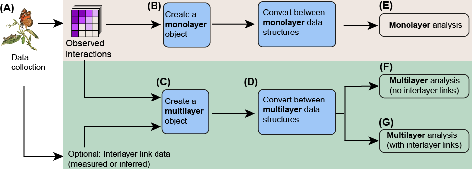

```{r klippy, echo=FALSE, include=TRUE}
# Use this to add a copy-code buttong
klippy::klippy(position = c('top', 'right'), color = 'darkred')
```


This website contains complete examples for working with monolayer and multilayer network data with the package EMLN. It is rather self-explanatory but we recommend to read the paper [**Practical guidelines and the EMLN R package for handling ecological multilayer networks**](https://besjournals.onlinelibrary.wiley.com/doi/10.1111/2041-210X.14225) to really understand it. The general workflow is described in the figure below. We start with monolayer networks, which are the basis for handling multilayer networks. Our paper and this website focus on handling data (blue rectangles in the figure), and not on analysis.



# Citing this work
Frydman N, Freilikhman S, Talpaz I, Pilosof S. **Practical guidelines and the EMLN R package for handling ecological multilayer networks**. Methods in Ecology and Evolution. 2023. [DOI:10.1111/2041-210X.14225](https://besjournals.onlinelibrary.wiley.com/doi/10.1111/2041-210X.14225). Please cite the paper when implementing the guidelines we describe or when using the package, this helps us a lot!


# Installation
The EMLN package was built under R 4.1.0 and depends on several packages. The package is installed directly from GitHub. Run this code to install dependencies and the package. We are working on a CRAN version.

```{r eval=FALSE, include=TRUE}
package.list=c("tidyverse", "magrittr","igraph","Matrix","DT","hablar","devtools")
loaded <-  package.list %in% .packages()
package.list <-  package.list[!loaded]
installed <-  package.list %in% .packages(TRUE)
if (!all(installed)) install.packages(package.list[!installed],repos="http://cran.rstudio.com/")

devtools::install_github('Ecological-Complexity-Lab/emln', force=T)
library(emln)
```

# Do I need anything to get started?
This is a technical reference. Therefore, we assume at least some basic experience with monolayer network analysis. Also, some familiarity with the basic concepts and theory of multilayer networks is highly recommended. Some recommended reading if you do not have that background:

**Ecological multilayer networks**

* Pilosof S, Porter MA, Pascual M, Kéfi S. The multilayer nature of ecological networks. Nat Ecol Evol. 2017;1: 0101. doi:10.1038/s41559-017-0101
* Hutchinson MC, Bramon Mora B, Pilosof S, Barner AK, Kéfi S, Thébault E, et al. Seeing the forest for the trees: Putting multilayer networks to work for community ecology. Godoy O, editor. Funct Ecol. 2019;33: 206–217. doi:10.1111/1365-2435.13237

**Mathematics of multilayer networks**

* De Domenico M, Solé-Ribalta A, Cozzo E, Kivelä M, Moreno Y, Porter MA, et al. Mathematical formulation of multilayer networks. Phys Rev X. 2013;3: 041022. doi:10.1103/PhysRevX.3.041022
* Kivelä M, Arenas A, Barthelemy M, Gleeson JP, Moreno Y, Porter MA. Multilayer networks. J Complex Networks. 2014;2: 203–271. doi:10.1093/comnet/cnu016

**Visual guide**
[visual guide by Manlio De Domenico](https://github.com/manlius/muxViz/blob/master/gui-old/theory/README.md)

___

```{r out.height="80px", out.extra='style="float:left, padding:10px"', echo=FALSE}

```


