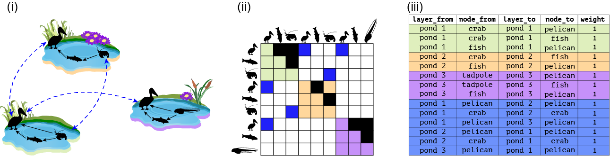
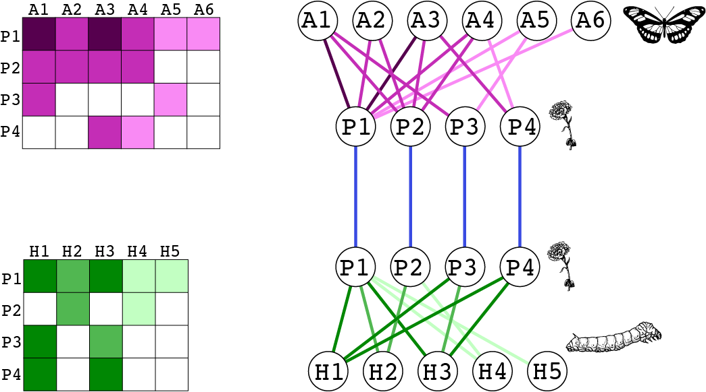
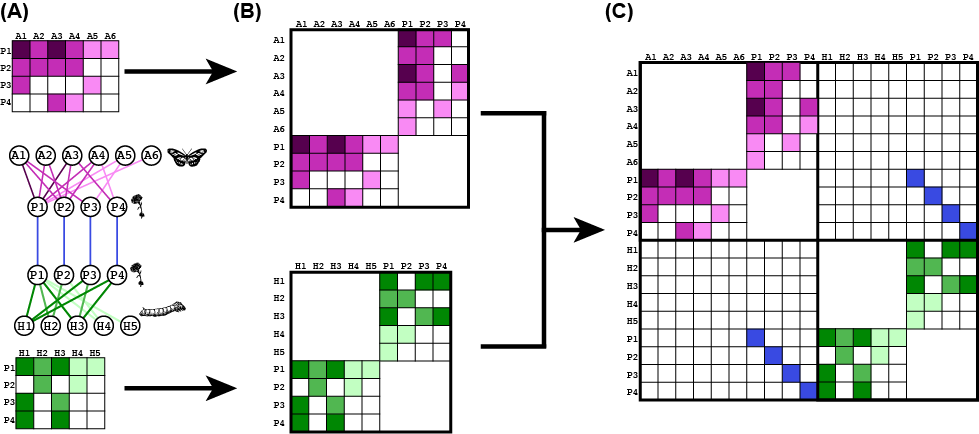

```{r klippy, echo=FALSE, include=TRUE}
# Use this to add a copy-code buttong
klippy::klippy(position = c('top', 'right'), color = 'darkred')
```

```{r setup, include=FALSE}
knitr::opts_chunk$set(echo = T, message=FALSE, warning=FALSE, cache=FALSE)
```

```{r message=FALSE, warning=FALSE}
library(emln)
library(igraph)
library(tidyverse)
library(bipartite)
library(magrittr)
```

# Unipartite multilayer network


## Toy example

We start with a toy example using Fig. 1A from the paper shown below.




```{r emln_fig1A_1}
pond_1 <- matrix(c(0,1,1,0,0,1,0,0,0), byrow = T, nrow = 3, ncol = 3, dimnames = list(c('pelican','fish','crab'),c('pelican','fish','crab')))

pond_2 <- matrix(c(0,1,0,0,0,1,0,0,0), byrow = T, nrow = 3, ncol = 3, dimnames = list(c('pelican','fish','crab'),c('pelican','fish','crab')))

pond_3 <- matrix(c(0,1,1,0,0,1,0,0,0), byrow = T, nrow = 3, ncol = 3, dimnames = list(c('pelican','fish','tadpole'),c('pelican','fish','tadpole')))

layer_attrib <- tibble(layer_id=1:3,
                     layer_name=c('pond_1','pond_2','pond_3'),
                     location=c('valley','mid-elevation','uphill'))


# Create the ELL tibble with interlayer links.
interlayer <- tibble(layer_from=c('pond_1','pond_1','pond_1'),
                     node_from=c('pelican','crab','pelican'),
                     layer_to=c('pond_2','pond_2','pond_3'), 
                     node_to=c('pelican','crab','pelican'),
                     weight=1)

# This is a directed network so the links should go both ways, even though they are symmetric.
interlayer_2 <- interlayer[,c(3,4,1,2,5)]
names(interlayer_2) <- names(interlayer)
interlayer <- rbind(interlayer, interlayer_2)


# This example is commented out because it cannot run. It fails because we provide interlayer links, which include layer names, but not the layer attributes that contain the layer names
# multilayer <- create_multilayer_network(list_of_layers = list(pond_1, pond_2, pond_3),
#                           interlayer_links = interlayer,
#                           bipartite = F,
#                           directed = T)

# When layer attributes are not included they are auto-generated
multilayer <- create_multilayer_network(list_of_layers = list(pond_1, pond_2, pond_3), 
                                        bipartite = F, 
                                        directed = T)

multilayer$layers

# An example with layer attributes and interlayer links
multilayer_unip_toy <- create_multilayer_network(list_of_layers = list(pond_1, pond_2, pond_3),
                          interlayer_links = interlayer,
                          layer_attributes = layer_attrib,
                          bipartite = F,
                          directed = T)
```

# The `multilayer` class
 The resulting `multilayer` class includes the following tables:
 
* **nodes:** Physical nodes. First column is a unique node id. Node attributes are included if provided as input.
* **layers:** Information on layers.
* **extended:** An extended link list of the format `layer_from node_from layer_to node_to weight`. All nodes and layers are identified by names.
* **extended_ids:** An extended link list of the format `layer_from node_from layer_to node_to weight`. All nodes and layers are identified by unique IDs automatically generated.
* **state_nodes:** List of state nodes of the format `layer_id node_id layer_name node_name`. Also includes state node attributes if provided as input.


```{r}
multilayer_unip_toy
```

# Working with node and link attributes

Now let's try to provide attributes for state nodes. That is, a specific attribute of a physical node in a layer. For instance, the abundance of species can change between layers. When providing state nodes the names of the nodes and the layers must be the same as in the list of layers and in the layer attribute table.

We also include in this example attributes of intralayer links. This can be done when the input is a link list. **When providing link attributes, the headers of all the layers' link lists, and that of the interlayer links, must be the same, even if not all the attributes are provided in all layers.** Here, we add a link attribute called method.

```{r emln_fig1A_2}

# Input will be link lists
pond_1_ll <- matrix_to_list_unipartite(pond_1, directed = T)$edge_list
pond_2_ll <- matrix_to_list_unipartite(pond_2, directed = T)$edge_list
pond_3_ll <- matrix_to_list_unipartite(pond_3, directed = T)$edge_list

# Add attributes to links
pond_1_ll$method <- c('observation', 'observation', 'gut analysis')
pond_2_ll$method <- c('observation', 'gut analysis')
pond_3_ll$method <- c('observation', 'observation', 'gut analysis')
# Check that the column names correspond after the weight column
identical(names(pond_1_ll)[4:length(pond_1_ll)], names(interlayer)[6:length(interlayer)])
# The column names after the weight in the interlayer must be the same as in the layers' link lists
interlayer$method <- NA
identical(names(pond_1_ll)[4:length(pond_1_ll)], names(interlayer)[6:length(interlayer)])

# Add state node attributes
pond_1_sn <- data.frame(node_name=c('fish','pelican','crab'),n=c(10,1,100))
pond_2_sn <- data.frame(node_name=c('fish','pelican','crab'),n=c(20,2,200))
pond_3_sn <- data.frame(node_name=c('fish','pelican','tadpole'),n=c(30,3,300))
abundance_sn <- bind_rows(pond_1_sn, pond_2_sn, pond_3_sn) %>% 
  mutate(layer_name=rep(c('pond_1','pond_2','pond_3'),each=3)) %>% 
  select(node_name, layer_name, n) # make sure node_name is the first column

# Add attributes of the physical nodes
physical_node_attrib <- data.frame(node_name=c('fish','pelican','crab','tadpole'), 
                                   order=c('Chondrichthyes','Pelecaniformes','Decapoda','Anura'))

multilayer_unip_attributes <- create_multilayer_network(list_of_layers = list(pond_1_ll, pond_2_ll, pond_3_ll),
                          interlayer_links = interlayer,
                          layer_attributes = layer_attrib,
                          state_node_attributes=abundance_sn %>% select(node_name, layer_name, ),
                          physical_node_attributes=physical_node_attrib,
                          bipartite = F,
                          directed = T)
```

Note that the node, state_nodes and link tables now include the attributes.

```{r}
multilayer_unip_attributes
```


# Example with real data from Kefi 2016

This is a node-aligned multiplex network with three layers: trophic interactions, non-trophic positive interactions and non-trophic negative interactions.

First, we will see how we can use matrices as input. Along the way we perform sanity checks such as making sure the number and identity of of species is the same in the 3 layers.

```{r}
# Load and organize the trophic interactions matrix
chilean_TI <- read_delim('chilean_TI.txt', delim = '\t')
nodes <- chilean_TI[,2]
names(nodes) <- 'Species'
chilean_TI <- data.matrix(chilean_TI[,3:ncol(chilean_TI)])
dim(chilean_TI)
dimnames(chilean_TI) <- list(nodes$Species,nodes$Species)

# Load and organize the negative non-trophic interactions matrix
chilean_NTIneg <- read_delim('chilean_NTIneg.txt', delim = '\t')
nodes <- chilean_NTIneg[,2]
names(nodes) <- 'Species'
chilean_NTIneg <- data.matrix(chilean_NTIneg[,3:ncol(chilean_NTIneg)])
dim(chilean_NTIneg)
dimnames(chilean_NTIneg) <- list(nodes$Species,nodes$Species)

# Are all row and column names the same?
setequal(rownames(chilean_TI), rownames(chilean_NTIneg))
setequal(colnames(chilean_TI), colnames(chilean_NTIneg))

chilean_NTIneg <- chilean_NTIneg[rownames(chilean_TI),colnames(chilean_TI)]
all(rownames(chilean_TI)==rownames(chilean_NTIneg))

# Load and organize the negative non-trophic positive matrix
chilean_NTIpos <- read_delim('chilean_NTIpos.txt', delim = '\t')
nodes <- chilean_NTIpos[,2]
names(nodes) <- 'Species'
chilean_NTIpos <- data.matrix(chilean_NTIpos[,3:ncol(chilean_NTIpos)])
dim(chilean_NTIpos)
dimnames(chilean_NTIpos) <- list(nodes$Species,nodes$Species)

# Are all row and column names the same?
setequal(rownames(chilean_TI), rownames(chilean_NTIpos))
setequal(colnames(chilean_TI), colnames(chilean_NTIpos))

chilean_NTIpos <- chilean_NTIpos[rownames(chilean_TI),colnames(chilean_TI)]
all(rownames(chilean_TI)==rownames(chilean_NTIpos))

# Total number of links
sum(chilean_TI, chilean_NTIpos, chilean_NTIneg)

layer_attributes <- tibble(layer_id=1:3, layer_name=c('TI','NTIneg','NTIpos'))

multilayer_kefi <- create_multilayer_network(list_of_layers = list(chilean_TI,chilean_NTIneg,chilean_NTIpos),
                                             interlayer_links = NULL,
                                             layer_attributes = layer_attributes,
                                             bipartite = F,
                                             directed = T)

```

Now, we can try and use link lists as input. We will convert the matrices to link lists first.


```{r}

# This is for the Kefi data set
chilean_TI_ll <- matrix_to_list_unipartite(x = chilean_TI, directed = TRUE)$edge_list
chilean_NTIneg_ll <- matrix_to_list_unipartite(x = chilean_NTIneg, directed = TRUE)$edge_list
chilean_NTIpos_ll <- matrix_to_list_unipartite(x = chilean_NTIpos, directed = TRUE)$edge_list

multilayer_kefi_ll <- create_multilayer_network(list_of_layers = list(chilean_TI_ll,chilean_NTIneg_ll,chilean_NTIpos_ll), layer_attributes = layer_attributes, bipartite = F, directed = T)

# Check that the set of links is the same in both
links_mat <- multilayer_kefi$extended_ids %>% unite(layer_from, node_from, layer_to, node_to)
links_ll <- multilayer_kefi_ll$extended_ids %>% unite(layer_from, node_from, layer_to, node_to)

any(duplicated(links_mat$layer_from))
any(duplicated(links_ll$layer_from))

setequal(links_mat$layer_from, links_ll$layer_from)
```


# Bipartite multilayer network

## Toy example

We will work with the toy example from Fig. 3 in the paper.



```{r}
pollination_layer <- matrix(c(5,3,5,3,1,1,
                              3,3,3,3,0,0,
                              3,0,0,0,1,0,
                              0,0,3,1,0,0), byrow = T, nrow = 4, ncol = 6,
                            dimnames = list(paste('P',1:4,sep=''),paste('A',1:6,sep='')))

herbivory_layer <- matrix(c(6,4,6,2,2,
                            0,4,0,2,0,
                            6,0,4,0,0,
                            6,0,6,0,0), byrow = T, nrow = 4, ncol = 5,
                            dimnames = list(paste('P',1:4,sep=''),paste('H',1:5,sep='')))


layer_attrib <- tibble(layer_id=1:2,
                     layer_name=c('Pollination','Herbivory'),
                     Method=c('Observation','Collection'))


# Create the ELL tibble with interlayer links.
interlayer <- tibble(layer_from=c('Pollination','Pollination','Pollination','Pollination'),
                     node_from=c('P1','P2','P3','P4'),
                     layer_to=c('Herbivory','Herbivory','Herbivory','Herbivory'), 
                     node_to=c('P1','P2','P3','P4'),
                     weight=1)

multilayer_bip_toy <- create_multilayer_network(list_of_layers = list(pollination_layer, herbivory_layer), bipartite = T, directed = F, interlayer_links = interlayer, layer_attributes = layer_attrib)

# Now add information on state nodes for pollinators
abundance_sn <- data.frame(layer_name=c('Pollination','Pollination','Pollination'), node_name=c('A1','A2','A3','A4','A5','A6'), abund=c(15,20,7,8,12,3))

multilayer <- create_multilayer_network(list_of_layers = list(pollination_layer, herbivory_layer), bipartite = T, directed = F, interlayer_links = interlayer, layer_attributes = layer_attrib, state_node_attributes = abundance_sn)
```

## Real data example

We will work with data from the paper [Hot spots of mutualistic networks (Gilarranz et al 2014. J Anim Ecol)](http://dx.doi.org/10.1111/1365-2656.12304). The data contains 12 layers (patches) of plant-pollinator interactions. We use the original data, provided in Excel to show how working with real data feels like. This illustrates the workflow discussed in the paper.

```{r}
library(readxl)
# Import layers
Sierras_matrices <- NULL
for (layer in 1:12){
  d <- suppressMessages(read_excel('Gilarranz2014_Datos_Sierras.xlsx', sheet = layer+2))
  web <- data.matrix(d[,2:ncol(d)])
  rownames(web) <- as.data.frame(d)[,1]
  web[is.na(web)] <- 0
  Sierras_matrices[[layer]] <- web
}

# Layer dimensions
sapply(Sierras_matrices, dim)

# Layer attribute table
layer_attrib <- tibble(layer_id=1:12,
                     layer_name=excel_sheets('Gilarranz2014_Datos_Sierras.xlsx')[3:14])

multilayer_sierras <- create_multilayer_network(list_of_layers = Sierras_matrices, bipartite = T, directed = F, layer_attributes = layer_attrib)
```

To illustrate working with interlayer links, we will connect a pollinator to itself between layers, and weigh these links by the distance between the layers. **We emphasize that this is for illustration purposes only; there is no hypothesis behind this exercise.** We already calculated the distances between the 12 patches.

```{r}
dist <- data.matrix(read_csv('Gilarranz2014_distances.csv'))
dimnames(dist) <- list(layer_attrib$layer_name, layer_attrib$layer_name)

# Get the dispersal matrix, for pollinators only. This matrix shows which pollinator is in which layer
dispersal <- multilayer_sierras$extended %>% group_by(node_from) %>% dplyr::select(layer_from) %>% table()
dispersal <- 1*(dispersal>0)

Sierras_interlayer <- NULL
for (s in rownames(dispersal)){ # For each pollinator
  x <- dispersal[s,]
  locations <- names(which(x!=0)) # locations where pollinator occurs
  if (length(locations)<2){next}
  pairwise <- combn(locations, 2)
  # Create interlayer edges between pairwise combinations of locations
  for (i in 1:ncol(pairwise)){
    a <- pairwise[1,i]
    b <- pairwise[2,i]
    weight <- dist[a,b] # Get the interlayer edge weight
    Sierras_interlayer %<>% bind_rows(tibble(layer_from=a, node_from=s, layer_to=b, node_to=s, weight=weight))
  }
}

# Re-create the multilayer object with interlayer links
multilayer_sierras_interlayer <- create_multilayer_network(list_of_layers = Sierras_matrices, bipartite = T, directed = F, layer_attributes = layer_attrib, interlayer_links = Sierras_interlayer)

# See the interlayer links
multilayer_sierras_interlayer$extended %>% filter(layer_from!=layer_to)
multilayer_sierras_interlayer$extended_ids %>% filter(layer_from!=layer_to)
```

<!-- ## Example of linking node/layer attributes with network topology -->

# Converting a multilayer class

## To supra-adjacency matrices

A SAM is convenient for matrix operations. See a [visual guide](https://github.com/manlius/muxViz/blob/master/gui-old/theory/README.md#operatively-rank-4-tensors-can-be-mapped-into-rank-2-supra-adjacency-matrices-to-facilitate-operations-with-care) on the idea of tensor flattening and producing SAM. Use the function `get_sam` to obtain a SAM. See `?get_sam` for an explanation on what the function returns.

### Unipartite example

Let's take take the toy unipartite network first. This is a directed network.


```{r}
# Order the physical nodes as in the image for convenience
multilayer_unip_toy$nodes <- multilayer_unip_toy$nodes[c(3,2,1,4),]

# get the SAM
sam_unipartite <- get_sam(multilayer = multilayer_unip_toy, bipartite = F, directed = T, sparse = F, remove_zero_rows_cols = F)
```

The SAM contains 3 layers by 4 physical nodes = 12 state nodes.
```{r}
sam_unipartite$M
```

**The row and column names correspond to the `sn_id` column in `sam_unipartite$state_nodes_map`.**  However, not all nodes always occur in all layers. This will be reflected in the `state_nodes_map`: When layer and node ids are NA that means that the node did not occur in the layer.

```{r}
sam_unipartite$state_nodes_map
```

A node may not have links across all the layers. In that case, its row or column sum will be zero. This can happen in a directed network like this one; for example, the tadpole does not have incoming links. The user can choose to remove rows and columns that sum to zero by setting `remove_zero_rows_cols to TRUE.

```{r}
sam_unipartite <- get_sam(multilayer = multilayer_unip_toy, bipartite = F, directed = T, sparse = F, remove_zero_rows_cols = T)
# That matrix has less than 12 rows/columns
dim(sam_unipartite$M)
sam_unipartite$M
```

When matrices are very large and sparse, excess of zeroes takes a lot of memory. It is possible to use a sparse matrix.

```{r}
sam_unipartite <- get_sam(multilayer = multilayer_unip_toy, bipartite = F, directed = T, sparse = T, remove_zero_rows_cols = T)
sam_unipartite$M
```


### Bipartite example

Bipartite networks are rectangular matrices. Therefore, it is necessary first to transform the incidence matrix to a square adjacency matrix. A visual example is in the figure below, in panels A-->B. Each layer is independently transformed. Then the layers are put together to a SAM as for unipartite network (panel C).



Now that the network is effectively a unipartite network, we proceed as with the previous example (e.g., state nodes and rows/columns that sum to zero).

#### Toy example

We will start with the example in this figure. We already created this network. Note the `bipartite` and `directed` arguments.

```{r}
# get the SAM
sam_bipartite <- get_sam(multilayer = multilayer_bip_toy, bipartite = T, directed = F, sparse = F, remove_zero_rows_cols = F)

```

Because this is a diagnoally-copouled network and only plants are common between layers, there will be many NAs in the state node table.

```{r}
sam_bipartite$state_nodes_map
```

Also possible to remove zero rows/cols and get a sparse matrix
```{r}
sam_bipartite <- get_sam(multilayer = multilayer_bip_toy, bipartite = T, directed = F, sparse = F, remove_zero_rows_cols = T)
# That matrix has less than 12 rows/columns
dim(sam_bipartite$M)
sam_bipartite$M

# Sparse
sam_bipartite <- get_sam(multilayer = multilayer_bip_toy, bipartite = T, directed = F, sparse = T, remove_zero_rows_cols = T)
sam_bipartite$M
```

Note that in this undirected network, each layer and the final SAM are symmetric.

```{r}
Matrix::isSymmetric(sam_bipartite$M) # Does not work on sparse matrices
```


#### Temporal bipartite

The past example was a 
Now let's try an example with a directed, temporal bipartite network. We will use the pollination layer from the previous example to start with, and we will work with the same pollinators and plants.

```{r}
time_1 <- matrix(c(5,3,5,3,1,1,
                   3,3,3,3,0,0,
                   3,0,0,0,1,0,
                   0,0,3,1,0,0), byrow = T, nrow = 4, ncol = 6,
                   dimnames = list(paste('P',1:4,sep=''),paste('A',1:6,sep='')))

time_2 <- matrix(c(7,0,5,3,0,1,
                   5,2,3,2,0,1,
                   1,0,0,0,1,0,
                   0,2,2,1,0,0), byrow = T, nrow = 4, ncol = 6,
                   dimnames = list(paste('P',1:4,sep=''),paste('A',1:6,sep='')))

time_3 <- matrix(c(5,1,1,1,0,1,
                   3,0,1,1,0,1,
                   2,0,0,0,0,0,
                   1,0,0,1,0,0), byrow = T, nrow = 4, ncol = 6,
                   dimnames = list(paste('P',1:4,sep=''),paste('A',1:6,sep='')))

# Plot the layers
visweb(time_1, type = 'none')
visweb(time_2, type = 'none')
visweb(time_3, type = 'none') # A5 has no links here
```

```{r}
layer_attrib <- tibble(layer_id=1:3, layer_name=c('Time_1','Time_2', 'Time_3'))
                    
# Create the ELL tibble with interlayer links.
# We will link a some plant species for the example. The value is 100 so they will be easy to spot
interlayer <- tibble(layer_from=c('Time_1', 'Time_2', 'Time_2', 'Time_2'),
                     node_from= c('P1',     'P1',     'P2',     'P4'),
                     layer_to=  c('Time_2', 'Time_3', 'Time_3', 'Time_3'), 
                     node_to=  c('P1',     'P1',     'P2',     'P4'),
                     weight=c(100,100,100,100))

multilayer_bip_temporal <- create_multilayer_network(list_of_layers = list(time_1, time_2,time_3), bipartite = T, directed = F, interlayer_links = interlayer, layer_attributes = layer_attrib)
```

Now get the SAM. Notice that interlayer links are only on one matrix diagonal off-blocks.

```{r}
temporal_SAM <- get_sam(multilayer_bip_temporal, bipartite = T, directed = T, sparse = T)
temporal_SAM$M
Matrix::isSymmetric(temporal_SAM$M) # Should be FALSE
```


#### Real data example

This example shows that the function can handle large networks. This is the spatial network we used before.
```{r}
# Without interlayer links
sierras_SAM <- get_sam(multilayer = multilayer_sierras, bipartite = T, directed = F, sparse = T, remove_zero_rows_cols = F)
sum(sierras_SAM$M)==2*nrow(multilayer_sierras$extended) # Number of interactions in the SAM should be links the number of links because we created the square matrices

# With interlayer links
sierras_SAM_interlayer <- get_sam(multilayer = multilayer_sierras_interlayer, bipartite = T, directed = F, sparse = T, remove_zero_rows_cols = F)

# Look at a subset of the data
sierras_SAM_interlayer$M[1:20,1:20]
```


## To igraph objects

igraph is used frequently for analysis. Hence, it is convenient to obtain a list of igraph objects as layers. This can be done with the `get_igraph` function. The attributes of the links, state nodes and the physical nodes are all included in the igraph objects. We will show this using the ponds example with atteibutes we used before. The `sn_id` corresponds to that in the `state_nodes_map`.

```{r}
g_layers <- get_igraph(multilayer_unip_attributes, bipartite = F, directed = T)
```

Let's look at one layer as an example.

```{r}
g_layers$layers_igraph[[2]]
```

The state nodes are listed below. Note that they include the attributes of the physical nodes (order in this example), and that all attributes are included in the igraph objects.

```{r}
g_layers$state_nodes_map

# Attributes in pond 1
vertex.attributes(g_layers$layers_igraph[[1]])
edge.attributes(g_layers$layers_igraph[[1]])

#Attributes in pond 2
vertex.attributes(g_layers$layers_igraph[[2]])
edge.attributes(g_layers$layers_igraph[[2]])

#Attributes in pond 3
vertex.attributes(g_layers$layers_igraph[[3]])
edge.attributes(g_layers$layers_igraph[[3]])
```

Here is an example with a bipartite network.

```{r}
g_layers_bip <- get_igraph(multilayer = multilayer_bip_toy, bipartite = T, directed = F)
l2 <- g_layers_bip$layers_igraph[[2]]
l2
vertex.attributes(l2)
```


<!-- # Working with included data sets -->

<!-- ## Searching -->

<!-- ```{r} -->
<!-- view_emln() -->
<!-- load_emln() -->
<!-- ``` -->

<!-- ## Loading -->
<!-- We load the spatial multilayer network (network_id = 38) that comes with the package. The development of the network and other networks is described in the paper and in our Wiki page. This is a seed-Dispersal network (collected from Web of Life) with a spatial multilayer aspect. The network has five layers and 22 physical nodes, with a total of 84 interactions that are all intralayer, undirected, and weighted. There are no interlayer interactions recorded for this network. -->

<!-- ```{r} -->
<!-- d38 <- load_emln(38) -->

<!-- d38 -->
<!-- ``` -->


<!-- # Other -->

<!-- # Creating supra-adjacency matrices for bipartite networks -->

<!-- Use the example from the figure -->
<!-- ```{r} -->
<!-- #Test case for #48 Supra-adjacency matrix for bipartite layers -->

<!-- #Input - list of matrices -->
<!-- mat3 <- matrix(rbinom(16, 1, 0.6) * sample(1:4, 16, replace=TRUE), 4, 4) -->
<!-- mat4<- cbind (mat3,c(7,7,7,7)) -->

<!-- interlayer_edges <- data.frame(node_from = c('R1','R2','C1'), layer_from = c(1,2,1), node_to = c('R4','C4','R1'), layer_to = c(2,1,2), weight = c(23,33,43)) -->

<!-- tb<-create_multilayer_network(list(mat3, mat4), bipartite = TRUE, Directed = FALSE, isSupraMatrix = TRUE, Interlayer = interlayer_edges) -->

<!-- #Input - list of intralayer edges. -->
<!-- EdgeListB <- data.frame(from=c(1, 1, 2, 2, 2, 3, 3), to=c(4, 5, 6, 4, 5, 6, 5), weight=round(rnorm(7, 1, 0.2),2)) -->

<!-- interlayer_edges_E <- data.frame(node_from = c('1','5','3'), layer_from = c(1,2,1), node_to = c('4','3','1'), layer_to = c(2,1,2), weight = c(23,33,43)) -->

<!-- tb2_E<-create_multilayer_network(list(EdgeListB, EdgeListB), isMatrix = FALSE,bipartite = TRUE, Directed = FALSE, isSupraMatrix = TRUE, Interlayer = interlayer_edges_E) -->

<!-- #Issue 52 - Allow input of layers and state nodes -->

<!-- layersInput <- data.frame(layer_name = c('pond green','pond orange'), type = c('space','space')) -->

<!-- networkULayers<-create_multilayer_network(list(mat2, mat3), layersData = layersInput, bipartite = FALSE, Directed = TRUE, isSupraMatrix = FALSE) -->

<!-- networkBLayers<-create_multilayer_network(list(EdgeListB, EdgeListB), isMatrix = FALSE, layersData = layersInput, bipartite = TRUE, Directed = FALSE, isSupraMatrix = TRUE, Interlayer = interlayer_edges_E) -->
<!-- ``` -->


<!-- # Internal use from the Wiki -->

<!-- ```{r} -->
<!-- ```R -->
<!-- #Test case for #48 Supra-adjacency matrix for bipartite layers -->

<!-- #Input - list of matrices  -->
<!-- mat3 <- matrix(rbinom(16, 1, 0.6) * sample(1:4, 16, replace=TRUE), 4, 4) -->
<!-- mat2 <- mat3 -->
<!-- mat4<- cbind (mat3,c(7,7,7,7)) -->

<!-- interlayer_edges <- data.frame(node_from = c('R1','R2','C1'), layer_from = c(1,2,1), node_to = c('R4','C4','R1'), layer_to = c(2,1,2), weight = c(23,33,43)) -->

<!-- tb<-create_multilayer_network(list(mat3, mat4), bipartite = TRUE, Directed = FALSE, isSupraMatrix = TRUE, Interlayer = interlayer_edges) -->

<!-- #Input - list of intralayer edges. -->
<!-- EdgeListB <- data.frame(from=c(1, 1, 2, 2, 2, 3, 3), to=c(4, 5, 6, 4, 5, 6, 5), weight=round(rnorm(7, 1, 0.2),2)) -->

<!-- interlayer_edges_E <- data.frame(node_from = c('1','5','3'), layer_from = c(1,2,1), node_to = c('4','3','1'), layer_to = c(2,1,2), weight = c(23,33,43)) -->

<!-- tb2_E<-create_multilayer_network(list(EdgeListB, EdgeListB), isMatrix = FALSE,bipartite = TRUE, Directed = FALSE, isSupraMatrix = TRUE, Interlayer = interlayer_edges_E) -->

<!-- #Issue 52 - Allow input of layers and state nodes -->

<!-- layersInput <- data.frame(layer_name = c('pond green','pond orange'), type = c('space','space')) -->

<!-- networkULayers<-create_multilayer_network(list(mat2, mat3), layersData = layersInput, bipartite = FALSE, Directed = TRUE, isSupraMatrix = FALSE) -->

<!-- networkBLayers<-create_multilayer_network(list(EdgeListB, EdgeListB), isMatrix = FALSE, layersData = layersInput, bipartite = TRUE, Directed = FALSE, isSupraMatrix = TRUE, Interlayer = interlayer_edges_E) -->

<!-- ``` -->
```


